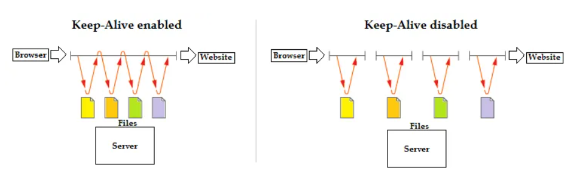

# [10분 테코톡] 🍪쿠기의 Connection Pool & Keep-Alive

## DBCP

DB에 접근하는 서비스 요청 처리 과정

1. 매번의 요청마다 connection이 필요하다.
2. 매번의 요청마다  **connection을 생성**한다.
3. connection을 통해 요청을 처리한다.
4. connection을 닫는다.

결론

1. 애플리케이션이 **느려진다.**
2. 사용자 수가 많아져, 커넥션 수가 너무 많아지면 **서버가 죽을 수 있다.**

고려사항

1. Connection Pool이 너무 작다면, 대기하는 요청이 많아진다.
2. Connection Pool이 너무 크다면, 메모리 낭비가 심해진다.
3. 접속자 수, 서버 부하 등을 고려해 적절한 크기로 조정한다.

 

## HTTP(TCP) 소프트웨어 개발 시 고려사항

1. **TCP handshake 설정**
2. **인터넷 혼잡을 제어하기 위한 TCP Slow Strat**
3. 데이터를 한데 모아 한번에 전송하기 위한 네이글 알고리즘
4. TCP 편승 확인 응답을 위한 확인 응답 지연 알고리즘
5. **TIME_WAIT 지연과 포트고갈**

### TCP Slow Strat

- 급작스러운 **부하와 혼잡** 막기 위한 목적
- TCP의 전송할 수 있는 **패킷 수**는 TCP 커넥션이 만들어진지 **얼마나 지났는지**에 영향을 받는다
- 데이터가 성공적으로 전송됨에 따라 패킷 수 늘려감
- Opening the congestion window
- 서버가 느려지는 단점

### TIME_WAIT

- Close 한 쪽에서 TIME_WAIT이 발생한다.
- IP주소와 포트번호를 메모리에 저장한다.
- 같은 IP주소와 포트 번호를 사용하는 TCP Connection을 일정 시간 동안 생성하지 않기 위해서 **잘못 된 패킷**을 받아 오동작을 할 수 있음.
- 안정을 위해 받지 않지만 계속된다면 포트 고갈로 응답 시간이 지연될 수 있다.

 

## HTTP(TCP) 통신의 문제점

HTTP(TCP) 통신의 문제점

1. TCP handshake 설정
2. 인터넷 혼잡을 제어하기 위한 TCP Slow Start
3. TIME_WAIT 지연과 포트고갈

성능개선

- 병렬 커넥션과 지속 커넥션을 통항 Connection Pool 방식

### 병렬커넥션

장점

- HTTP 클라이언트가 **여러개의 커넥션**을 맺음으로써 여러개의 트랜잭션을 병렬로 처리
- 페이지를 더 빠르게 내려 받는 효과
- 최신 브라우저 6~8개의 병렬 커넥션

단점

- 다수의 커넥션은 **메모리를 많이 소모하고 자체적인 성능 문제** 발생
- **TCP Slow Start**가 여러개의 커넥션에 적용
- 각 트랜잭션마다 **handshake** 발생으로 속도 떨어짐

### 지속커넥션

장점

- 커넥션 맺음 **(handshake) 최소화**
- TCP **Slow Starr 최소화** (재사용)
- 연결이 최소화 되어서, **TIME_WAIT**의 숫자가 줄어듬

단점

- 잘못 관리 할 경우 연결되어 있는 커넥션이 쌓이면 **불필요한 리소스가 발생**

### 병렬 커넥션 + 지속 커넥션

적은 수의 **병렬** 커넥션만을 유지하고 그것을 **지속**하는 것이 가장 효과적

= **HTTP Conection Pool ????**

 

## KEEP-ALIVE (계속 유지)

keep alive를 사용하지 않으면 중간 중간에 handshake가 발생

### Keep-Alive 동작

keep-alive handshake

1. 클라이언트는 커넥션을 유지하기위해 **'Connection: Keep-Alive'**헤더를 포함시킨다.
2. 이 요청을 받은 서버는 다음 요청도 이 커넥션을 통해 받고자 한다면, 응답 메시지에 **같은 헤더** 포함시켜 응답한다.
3. 응답에 'Connection:Keep-Alive'가 없으면, 클라이언트 서버가 keep-alive를 지원하지 않으며, **서버가 커넥션을 끊을 것이라 추정**한다.

 

## HTTP/1.1의 지속 커넥션

1. HTTP/1.0의 keep-alive 커넥션과 달리 HTTP/1.1의 지속 커넥션은 **기본으로 활성화** 되어있다.
2. 끊으려면 **'Connection:close'** 헤더를 명시해야 한다.
3. 클라이언트와 서버는 언제든지 **헤더 없이 클라이언트를 끊을 수 있다.**

