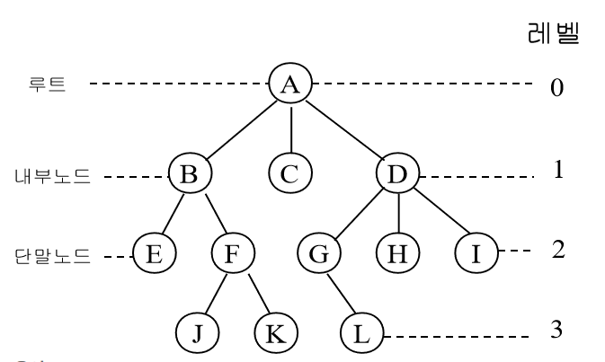
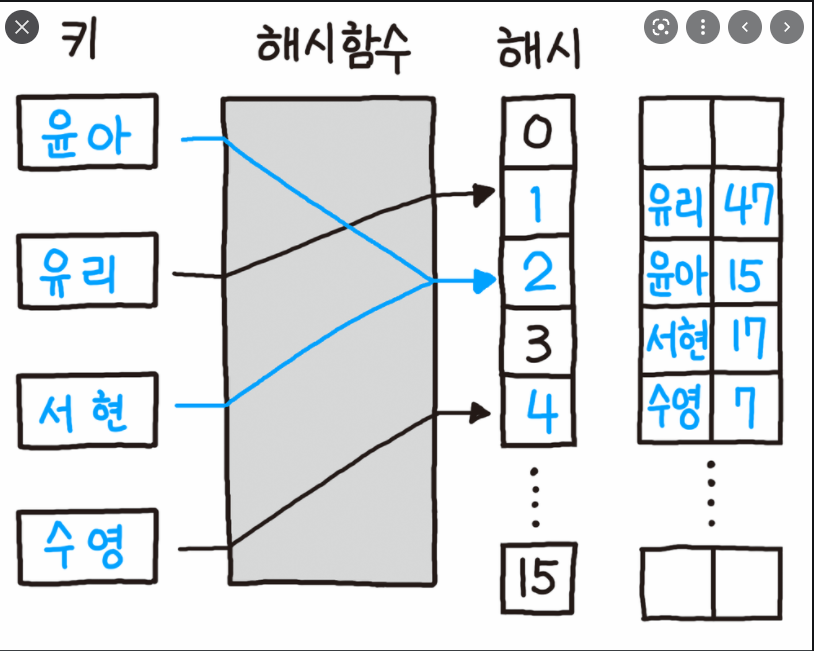
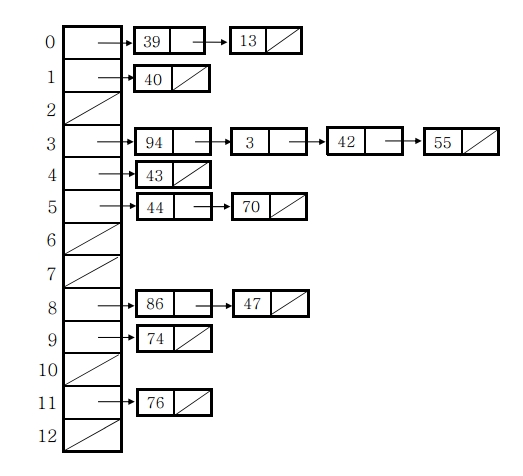
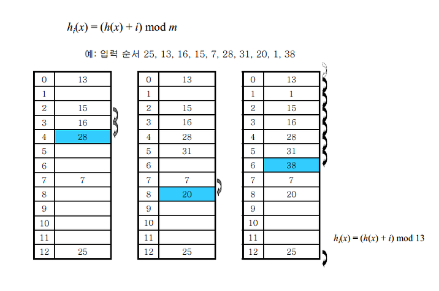
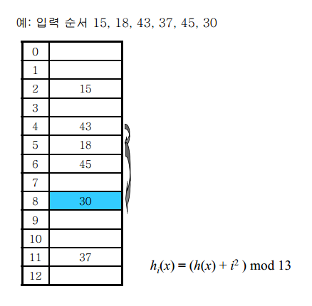

# [10분 테코톡] 👩‍🏫코니의 [#️⃣Hash](https://www.youtube.com/hashtag/⃣hash) Function

## hash function

### 트리

- 원소 하나를 저장하고 검색하는데 평균 θ(log n)의 시간 소요
- 자료를 저장하고 조회할때는 배열을 이용하는 것보다 트리를 이용하는것이 빠르고 좋다. >>>>> 자료가 많아지면 트리도 힘들다.

 

저장된 자료의 양에 상관없이 원소 하나를 저장하고 검색하는 것을 상수 시간에 가능하게 할수는 없을까?

 

### 해시 테이블

- 해시 함수에 키 값을 넣으면 해시 값이 나오고 나온 해시 값 주소에 값을 저장한다.

 

해시 테이블

- 임의의 원소를 해시 테이블에 저장하려면
  1. 해당 원소의 **해시값**을 해시 함수를 이용하여 계산
  2. 이 해시값을 주소로 하는 위치에 원소를 저장
  3. 저장 후에 검색을 할 때도 원소의 해시값을 계산해 바로 해당 위치로 이동
  4. 이렇게 해시 테이블은 원소를 저장할 위치를 **상수 시간**에 계산할 수 있다.
- 배열과 트리 구조 보다 조회 및 저장이 빠르다.

 

### 해시함수

- 임의의 길이의 데이터를 고정된 길이의 데이터로 매핑하는 함수
- ex) h(x) = x mod 13

 

### 좋은 해시 함수의 조건

- 계산이 간단해야 한다. (복잡하면 느려서 사용하는 의미 x)
- 입력 원소가 해시 테이블 전체에 고루 저장되어야 한다. (해시충돌 예방)

 

### 해시 충돌 해결: 체이닝(chaining)

-  같은 주소로 해싱되는 원소를 모두 하나의 연결 리스트에 매달아서 관리
- 원소를 검색할 때는 해당 연결 리스트의 원소들을 차례로 지나가면서 탐색
- 하지만 기존 비교를 하면서 찾는 방법을 해결하고자 해시테이블을 사용한다. 체이닝은 비교를 하기때문에 느려질수있다.

 

### 해시 충돌 해결 : 개방 주소 방법(open addressing)

- 체이닝과 달리 어떻게든 주어진 테이블 공간에서 해결한다.
- 따라서 모든 원소가 반드시 자신의 해시값과 일치하는 주소에 저장된다는 보장이 없다.
- 선형조사(linear probing), 이차원 조사(quadratic probing), 더블해싱(double hashing)

선형조사

- 가장 간단한 충돌 해결 방법
- 충돌이 일어난 자리에서 i에 관한 일차 함수의 보폭으로 점프한다.
- hi(x)는 h(x)에서 i만큼 떨어진 자리이다.
- 테이블의 경계를 넘어갈 경우에는 맨 앞으로 돌아간다.

이차원 조사

- 바로 뒷자리를 보는 대신 보폭을 이차 함수로 넓혀가면서 본다.
- 예를 들어, i번째 해시 함수를 h(x)에서 i^2만큼 떨어진 자리로 삼는다.
- 특정 영역에 원소가 몰려도 그 영역을 빨리 벗어날 수 있다.

더블 해싱

- 두 개의 함수를 사용한다.
- 하나의 함수는 최초의 해시값을 얻을 때, 다른 하나의 함수는 해시 충돌이 일어났을 때 이동할 폭을 얻을 때 사용한다.
- 두 원소의 첫 번째 해시값이 같더라도 두 번째 해시값까지 같을 확률은 매우 작으므로 서로 다른 보폭으로 점프를 하게 된다.

 

### 해시 함수의 특징

- 같은 입력값에 대해서 같은 출력값이 보장된다.
- 서로 다른 입력값으로부터 동일한 출력값이 나올 가능성이 희박하므로 입력값에 대한 무결성이 보장된다.
- 일방향성을 갖는다.
- 처음 설계할때 충돌을 충분히 예상하고 만들어야함

