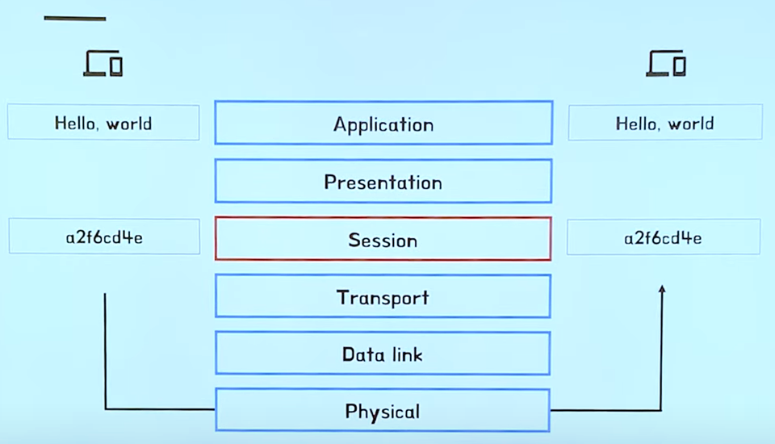
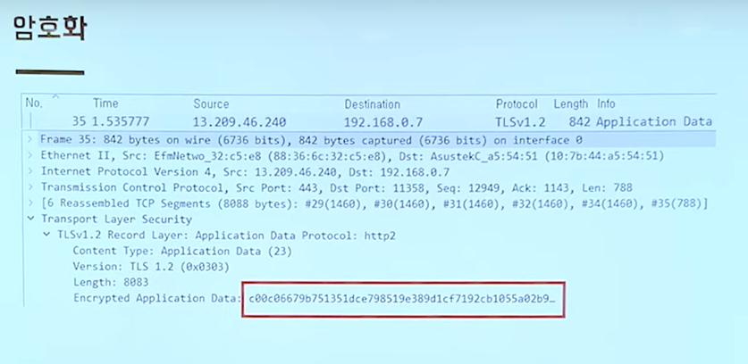
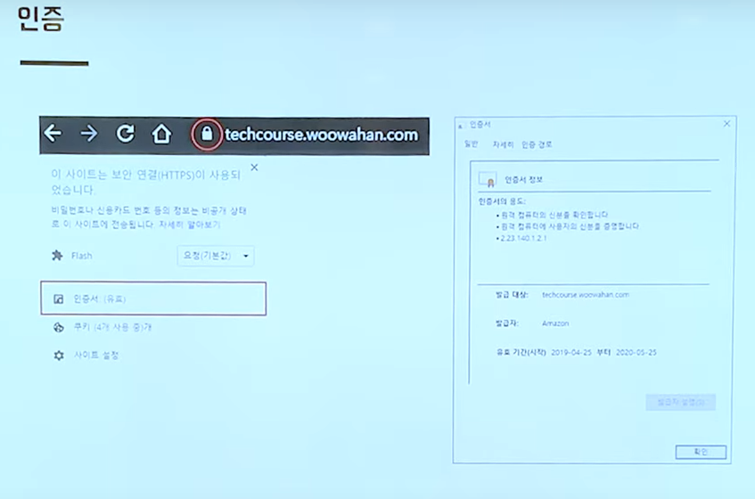
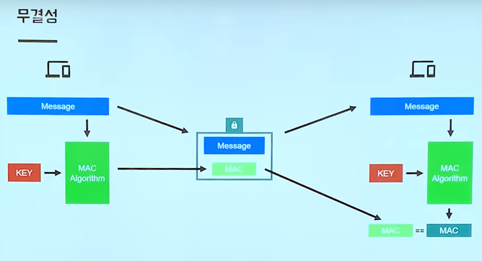

# [10분 테코톡] 👶에단의 TLS

## TLS

- TLS : Transport Layer Security, 전송 계층 보안
- 응용 계층 데이터의 암호화, 암호화된 전송 계층 데이터의 복호화
- TCP 443 포트를 사용
- HTTPS의 기반 기술

SSL

- 처음에는 SSL 기술은 회사가 발표한 기술이라 독점의 소지가 존재
- SSL 3.0 이후로 ITF가 TLS 1.0
- 현재는 TLS 1.3 버전

 

## TLS가 제공하는 기능

- 암호화 : 정해진 피어만 메시지의 내용을 확인할 수 있음
- 인증 : 메시지 발신자의 신원을 확인
- 무결성 : 메시지가 위/변조되지 않았음을 보장

암호화

인증

- 피싱 사이트는 자물쇠 모양. 인증서가 나오지 않음

무결성

- MAC : 메세지 인증 코드 

