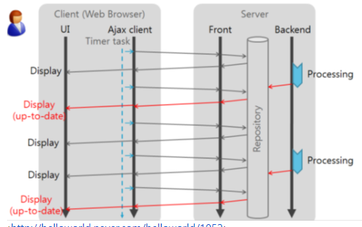
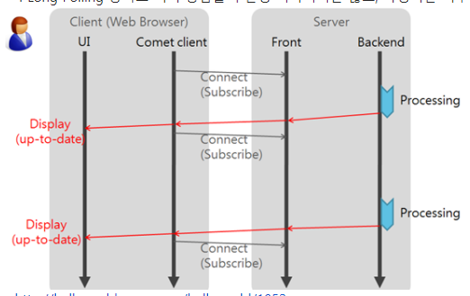

# [10분 테코톡] 😎유니의 Web polling vs Web push

## WHY?

정적 웹 페이지 : 미리 저장된 파일이 그대로 전달

동적 웹 페이지 : 사용자의 요청을 해석해서 동적으로 생성된 파일을 전달(다양한 정보를 조합하여 사용자 경험 향상)

- 완전한 HTML 페이지를 받아서 보여줌
- 일부 정보만 병경 되었더라도 완전히 새 페이지(모든 내용)를 가져와야 함
  - 실시간 웹(realTime web) : 페이지의 현재 상태를 방해하지 않고 서버와 통신

 

## web polling vs web push

실시간 웹을 만들기 위한 기술

- web polling : 기존 요청/응답에서 푸시처럼 보이게 만든 기술 (web push 이전)
- web push : 요청없이 서버에서 클라이언트로 정보를 전달 (요즘에 사용)

 

## web polling

- polling : 충돌 회피 또는 **동기화 처리** 등을 목적으로 상태르 **주기적으로 검사**하여 조건을 만족할 때 자료처리르 하는 방식
  - 실시간 메시지 전달이 크게 중요하지 않은 서비스(주기⬆, 요청 ⬆)에 사용
  - 불필요한 요청/응답이 많이 발생할 수 있음
  - 
- long polling : 클라이언트가 보낸 요청을 서버가 가지고 있다고 이벤트가 발생하면 정보를 전달받는 방식
  - 실시간 메시지 전달이 중요한 서비스
  - polling 방식에 비해 불필요한 요청/응답 덜 발생
  - 

 

## web push

- WebSocket : TCP 연결을 통해 **양방향 데이터 통신**을 제공
- Server Sent Events(sse) : HTTP 연결을 통해 서버에서 클라이언트로 데이터를 수신 가능하게 함