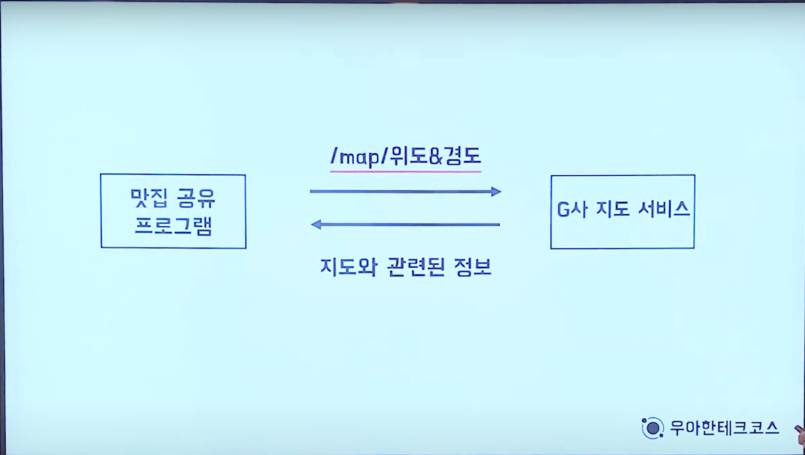

# [10분 테코톡] 🙆‍♀️티버의 API vs Library vs Framework

## API (Application Programming Interface)

응용 프로그램에서 운영 체제나 프로그래밍 언어가 제공하는 기능을 제어할 수 있게 만든 인터페이스(프로그램 간에 연결해주는 다리!!)

EX) 맛집 공유 서비스를 위해 Google 지도 서비스 사용

- /map/위도&경도 >>>>>>>> API

API의 특징

- 구현과 독립적으로 사양만 정의되어 있다.
- API에 따라 접근 권한이 필요할 수 있다.
- Java API, 여러 기업들의 오픈 API

 

##  Library

응용 프로그램 개발을 위해 필요한 기능(함수)을 모아 놓은 소프트웨어

Library의 특징

- 독립성을 가진다. (해당 라이브러리는 다른 라이브러리를 의존하지 않는다.)
- 응용 프로그램이 능동적으로 라이브러리를 사용한다.(능동적 : 프로그램이 필요할떄 호출하여 사용한다.)
- Apache Commons, Guava, Lombok, jQuery

 

## Framework (frame : 틀,뼈대  work : 일(하다))

응용 프로그램이나 소프트웨어의 솔루션 개발을 수월하게 하기 위해 **제공된 소프트웨어 환경**

EX) Spring Framework가 없을때

Socket, InputStream, OutStream, Request 생성  >>> 해당 요청을 처리할 컨트롤러 생성 >>> 컨트롤러에 비즈니스 로직 생성

Spring Framework가 있을때

해당 요청을 처리할 컨트롤러 생성 >>> 컨트롤러에 비즈니스 로직 생성

- 개발자가 개발을 위해 집중할 수 있도록 기반을 다져줌

Framework의 특징

- 상호협력하는 클래스와 인터페이스의 집합
- 응용 프로그램이 수동적으로 프레임워크에 의해 사용된다.
  - Library는 개발자가 짠 코드에서 불러오지만 Framework는 Spring이 개발자가 작성한 코드를 불러온다.
- Spring Framework, Junit, Ruby on Rails

 

## API vs Library vs Framework

### Library와 API의 차이점은 구현 로직의 유무이다.

### Library와 Framework의 차이점은 응용 프로그램의 흐름 주도권을 누가 가지고 있느냐 이다.

