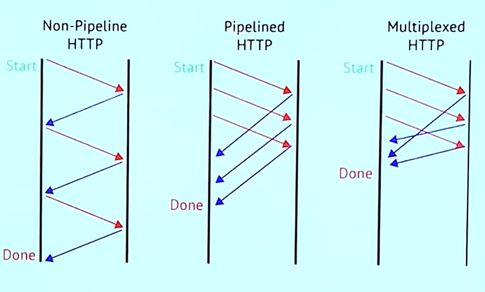
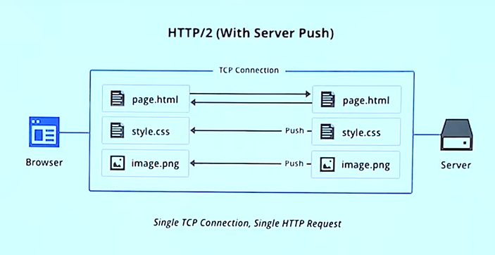

# [10분 테코톡] 🙆‍♂️아이크의 HTTP 2.0

## HTTP/1.x의 한계

- 버전이 향상되면서 데이터의 크기가 점점 커진다.
- 과거의 비해 늘어난 요청 수로 리소스 증가 (단순히 대역폭을 넓히는거에 한계가 찾아옴)
- 처음 요청한 요청 문제 발생 >> 다음 도착한 요청에 대한 처리가 늦어짐 >> 병목현상 발생 >> Latency 증가

결론 : TCP 성능 면에서 근본적인 문제가 해결되지 않았다.

 

## HTTP/2.0

HTTP/2.0의 기본 목표는 **멀티플렉싱**을 통해 Latency를 줄이고, **헤더압축**을 통해 Overhead를 최소화하며, **서버푸시**기능을 지원하는 것

### 멀티플렉싱

Frame

- HTTP/2에서 통신의 최소 단위
- 최소 하나의 프레임 헤더
- 바이너리로 인코딩

Message

- 다수의 프레임
- 요청 응답의 단위

Stream

- 양방향 통신을 통해 전달되는 한 개 이상의 메시지

결론 : 프레임이 여러개가 모여 메시지, 메시지가 여러개가 모여 스트림 >> 스트림 여러개를 통해 멀티플렉싱 가능

요청과 응답에 대한 병렬적 처리로 순차적인 처리를 깨어 TCP의 성능 저하를 막을 수 있다.

### 헤더 압축

데이터가 점차 커져 헤더 역시 압축의 필요성을 느껴 압축방식 도입

HPACK 압축방식

1. 헤더 인덱싱
2. 인코딩

### 서버 푸시

HTTP/1.x 웹페이지 요청이 들어오면..

1. HTML 요청
2. HTML 태그 파싱
3. 필요한 리소스(CSS, JS, PNG ..) 재요청
4. 웹페이지 완성

HTTP/2.0 웹페이지 요청이 들어오면..

1. HTML 요청
2. 웹페이지 완성

- 리소스를 서버에서 능동적으로 같이 보낸다.
- 시간 절약