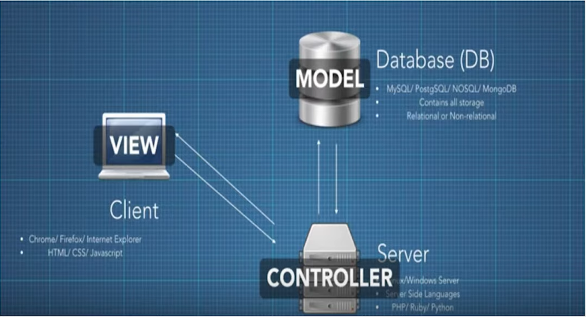

# [10분 테코톡] 🙋‍♂️제이엠의 MVC

## MVC에 대한 설명

Model : 평범한 자바객체 POJO

View : HTML, JSP, THYMELEAF..

Controller : UserController, AritcleController..

 

### 모델의 역할

Model : 도메인 객체 또는 DTO로 화면에 전달할 또는 화면에서 전달 받은 데이터를 담고 있는 객체 (@Entity), Database와 강하게 연관

View : 데이터를 보여주는 역할. 다양한 형태 : HTML, JSON, XML

Cotroller : 사용자 입력을 받아 모델 객체의 데이터를 변경하거나 뷰에 전달하는 역할. Ex) 입력값 검증, 모델 객체 변경, 변경된 모델 개체 뷰에 전달

 

### MVC 장점

- 동시다발적개발 : 백엔드 개발자와 프론트엔드 개발자 독립적으로 개발진행
- 높은 응집도 : 논리적으로 관련있는 기능을 하나의 컨트롤로러 묶거나, 특정 모델과 관련 있는 뷰로 그룹화 ex) 하나의 Controller에 다양한 URL Mapping
- 낮은 의존도 : 뷰, 모델, 컨트롤러 각각 독립적이다.
- 개발용이성 : 책임이 구분되어 있어 코드 수정 편안
- 한 모델에 대한 여러 형태의 뷰를 가짐 : HTML, JSON, THYMELEAF

 

### MVC단점

- 코드네비게이션 복잡함
- 코드 일관성 유지에 노력이 필요함
- 높은 학습 곡선
- 장점에 비해 단점이 훨씬 약하다.

 

## 기타

Servlet = Handler = Controller ?? 유사?

 

## 결론

Spring에서의 MVC 흐름 :

- DispatcherServlet이 Controller에게 Mapping해주고
- Controller안에 있는 작은 Servlet들이 데이터 조작 후 View를 준비함
- View가 Rendering해주면서 끝남

